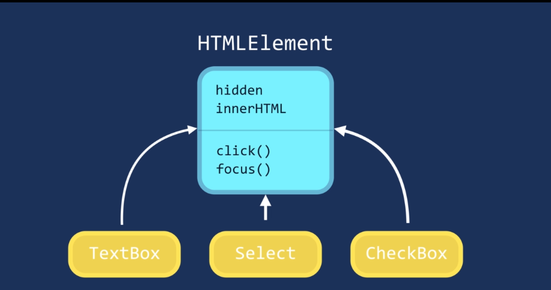

* What is OOP
    * A Programming paradigm centered around OBJECTS rather than FUNCTIONS.

* Style of programming OR programming paradigm.

* Encapsulation
* Abstraction
* Polymorphism
* Inheritance

## Procedural Programming

 Programme divided into set of functions.
 you have data stored in a bunch of variables and functions
 that operate on the data.

 This style of Programming is very simple and straightforward.
 When it's grower it will become as complex like spaghetti code. 

 Where OOP come to rescue,
 combine a group of related variables and functions into a unit. We call that unit an object.

 We Refer variable(x) as property and function(f()) as method.

 Ex: Car is an object.
 
    make
    model   -- properties
    color

    start()
    stop()  -- methods
    move()
 

 * One of the symptoms of procedural code is functions with so many parameters.
 * When you write in OO way, your functions end up having fewer and fewer parameters.

 * "The best functions are those with no parameters!"
 
 * The fewer no of parameters and the easier it is to use and maintain that function. So that's encapsulation.

 ### Abstraction
 * Simpler Interface
 * Reduce the impact of change.
    
 

 ### Inheritance

* A mechanism that allows you to eliminate redundant code.  

 ### Polymorphism

 * Many forms.
 * Allows you to get rid of long if and else or switch case statements.

 

* Classes in JavaScript are not like classes we have in languages like Java and C#,
Because JavaScript is dynamic type language.
* So classes are essentially syntactic suger, over prototypes and prototypical inheritance.

### Prototypical inheritance

What we need to do is

Create a object with given prototype
Circle.prototype = Object.Create(Shape.prototype)

Shape -> ObjectBase
Circle -> ShapeBase  -> ObjectBase

### Reset the constructor
Whenever you reset the prototype, make sure you reset the constructor as well.

Here when we check the constructor of Circle, Circle construct using Circle Object.

we can construct using Circle,
new Circle.prototype.constructor(1) => new Circle(1)
 
When we create the prototype using Shape,

We are having this problem when we reset the prototype of Circle.

Now you can see constructor is circle and inherit from Shape as well.

<b> So whenever you reset the perototype, make sure reset the constructor as the best practice.</b>

### Super Constructors

When we call just shape(arg) it will point out that to window object.

Now you can see, this point out to Circle.

### Intermediate Function Inheritance

This is okay, but too noisy when have multiple.

Now fixed using IntermediateFunction

### Method Overriding

When we have same function in Child and Parent, it will check first at child then parent. if found in child. it will return.

Also what if we want to call Parent and Child in same function.
By calling this using Prototype

Don't use Inheritance is just the sake of using it. especially in small projects.
* Start with simple objects, and then If you see no of objects share similar features,, then perhaps you can encapsulate those features inside of generic object and then inheritance.  Composition also another way to reuse.

 
 
Have to change heirachy
.

So, what if we have 10 types of animals, So Avoid creating INHERITANCE HEIRARCHIES.
If you wanna use it, keep it in one level. don't go more than that.

"Favour composition over Inheritance"

Mixins to achieve compositons. 

* Object.assign()  --> Copy the properties and methods from one object to another

Ex1:

Ex2:

Select * From departments.id,
employees.salary,
AVG(employees.salary) OVER (PARTITION BY departments.id) AS avg_salary,
    CASE 
        WHEN employees.salary >= AVG(employees.salary) OVER (PARTITION BY departments.id) THEN 'Above'
        ELSE 'Below'
    END AS salary_status
From departments
INNER JOIN employees ON departments.id=employees.id;
