Take properties and methods from another object.
Easy to reuse 

Classical vs Prototypical Inheritance

In JS, we don't have classes, we only have objects.
So, that's when prototypical inheritance comes in.

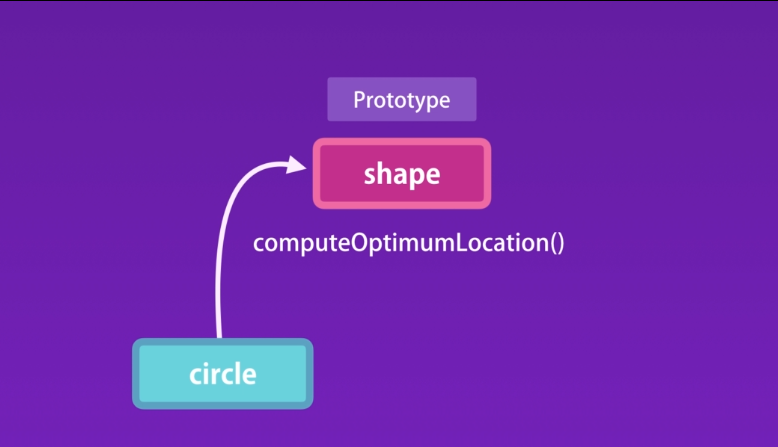

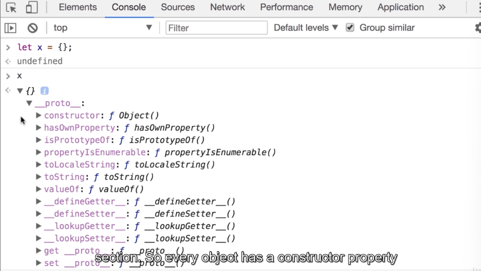
- Same as define let y = {}

Every object has a constructor property which references the
function that was used to construct or create the object.

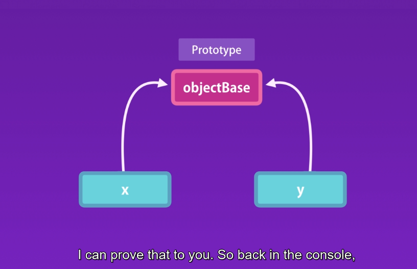

x.__proto__ in debug mode. but deprecated.

How prototypical inheritance works ?
Initially JS engine lookout x object properties and methods object itself, if that couldn't find it will go to (parent)prototype for that object. And if it can find that member, it will look at the prototype of that object all the way up to the root object which we call here objectBase.

A prototype is just a regular object in memory. There is nothing special about it.
Every object has a prototype or parent, except the root object.

### Multilevel inheritance
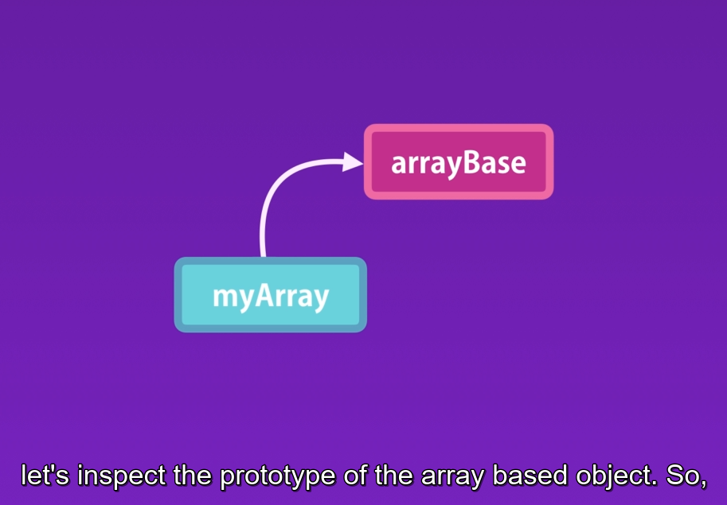

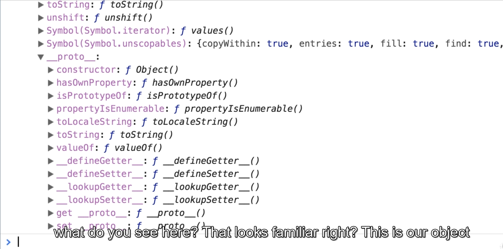

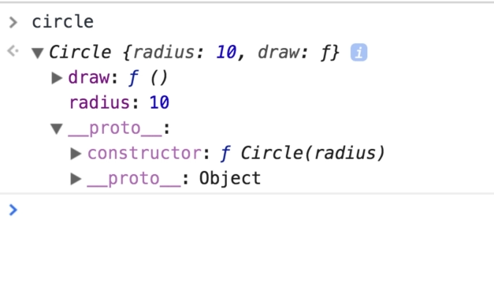
Object created by a given constructor will have the same prototype.

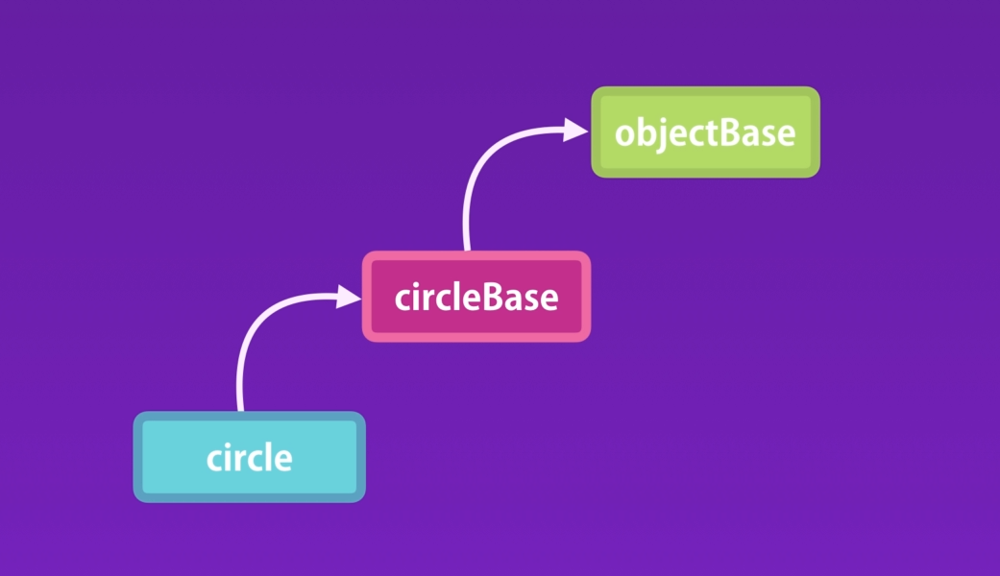

### Property Descriptor

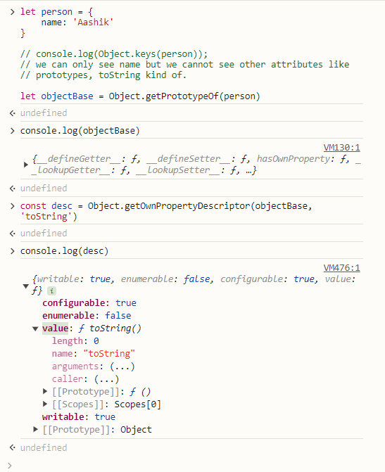

### Constructor Prototypes

Since we create that using object literal. Under the hood, we call Object constructor like new Object();

Same as like,
Array base
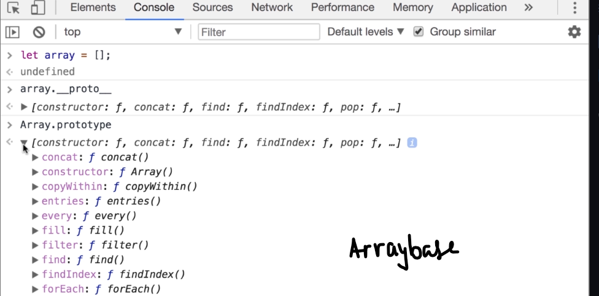

let array = []

array.__proto__

Array.prototype

Same as like,
Using Circle class constructor
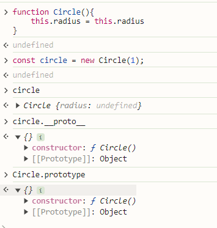

### Prototype vs Instance Members
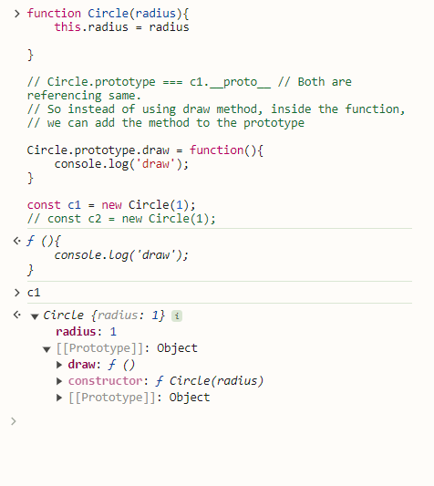

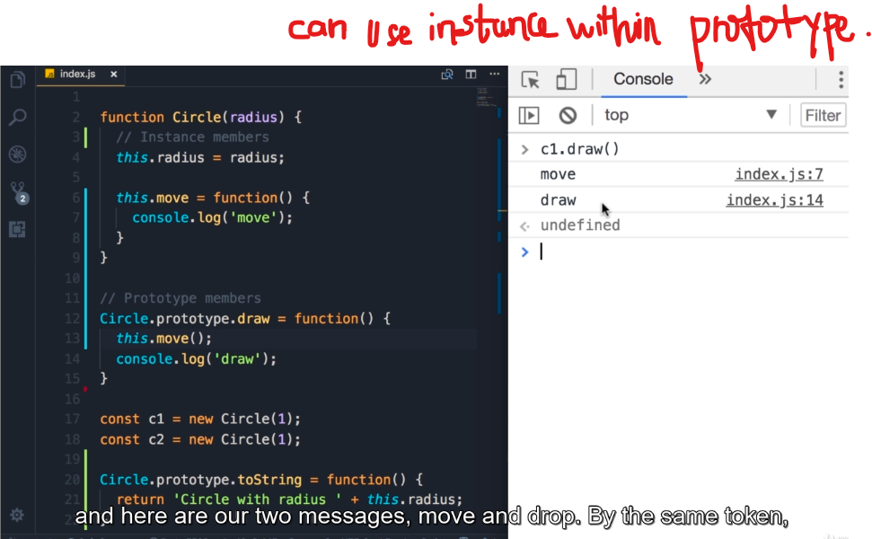

Prototype within instance.
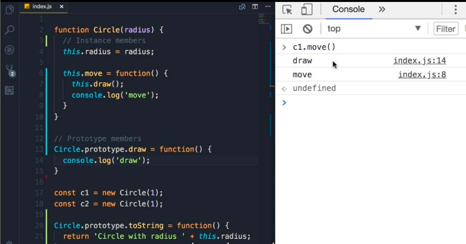

Own property vs Prototype
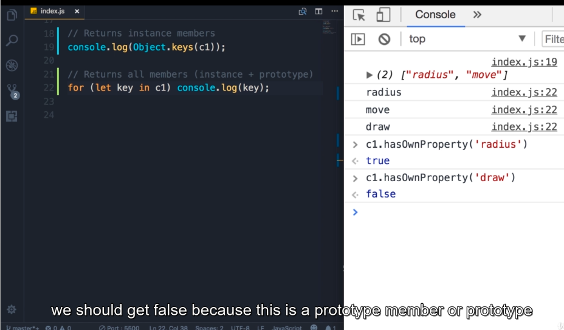

### Avoid Extending the Builtin Objects
Don't modify objects you don't own!.
