# Contents
* [Contents](#contents)
* [1 Basics for Beginners](#basics-for-beginners)
  * [Basics](#basics)
  * [Operators](#operators)
  * [If else](#if-else)
  * [Objects](#objects)
    * [Value vs Reference Types](#value-vs-reference-types)
* [2 Object Oriented Programming](#object-oriented-programming)
  * [Objects](#objects-1)
  * [Prototypes](#prototypes)
    * [Multilevel inheritance](#multilevel-inheritance)
    * [Property Descriptor](#property-descriptor)
    * [Constructor Prototypes](#constructor-prototypes)
    * [Prototype vs Instance Members](#prototype-vs-instance-members)
    * [Avoid Extending the Builtin Objects](#avoid-extending-the-builtin-objects)
  * [Classes](#classes)
    * [Function Declaration](#function-declaration)
    * [Function Expression](#function-expression)
    * [Private Members using Symbols](#private-members-using-symbols)
* [3 Common Function - JS](#common-used-javascript-functions) 

* [Important Concepts](#Important-concepts)

# Basics for Beginners

## Basics

**Data Types**


**2 types of programming languages.**

1. Static <br>
   string name = 'Jhon' <br>
   This type of variable cannot be changed after set

2. Dynamic <br>
   let name = 'Jhon' <br>
   Can change at runtime

**Reference types**

1. Object
2. Array
3. Function

## Operators

We use Operators with variables and constants to create
expressions. <br>
and with these expression we can create logic and algorithms.

--- Operators ---

1. Arithmetic
2. Assignment
3. Comparison
4. Logical
5. Bitwise


**Logical with Non Boolean**


## If else

// Conditional Statements
// If-else
// Switch-case

```javascript
if (conditon) {
    statment;
} else if (anotherConditon) {
    statment1;
    statement2;
} else if (yetAnotherConditon) statment;
else statement;
```

If one statement no need to put curly braces.

## Objects

### Value vs Reference Types

VALUE / PRIMITIVE <br>

1. Number
2. String
3. Boolean
4. Symbol
5. undefined
6. null

Reference <br>
Object <br>
Function <br>
Array <br>

in JS, we have Primitives and Objects. Almost Reference Types fulla objects <br>
How Primitives and Objects behave differently. <br>
SHOULD UNDERSTAND - for Prototypes <br>

Primitives are copied by their value. <br>
Ref types or Objects are copied by their reference. <br>


------Cloning Object-------------

Object.assign() copies the properties and methods from 1 or
more source objects into target object. <br>
we can use that to clone an object or combine multiple objects
into single object.

Spread Operator used to spread an object, means getting all 
it's properties and methods and putting them into another object.

<br>
--Garbage Collecter--------
In JS, we don't need to allocate or deallocate their memory
when declaring variables. <br>
it will do automatically by own.

<br>
-----Math---------
Math Object used to do arithmetic things.
Math.random()
Math.min()
Math.max()

---

Object is only have properties and methods. <br>
Not Primitives.

# Object Oriented Programming

[Notes of OOP](2OOP/Notes.md)

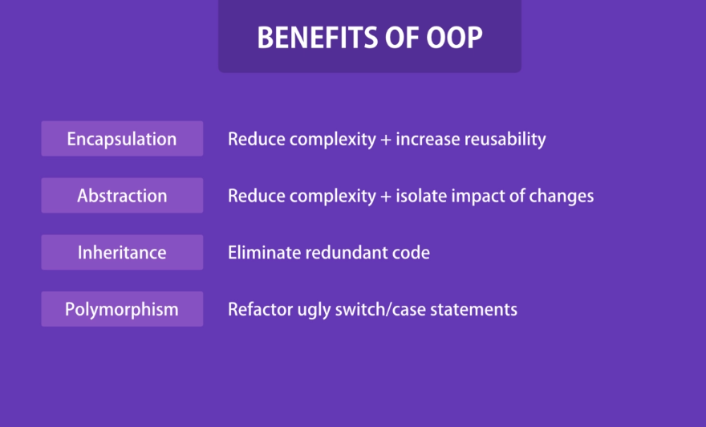

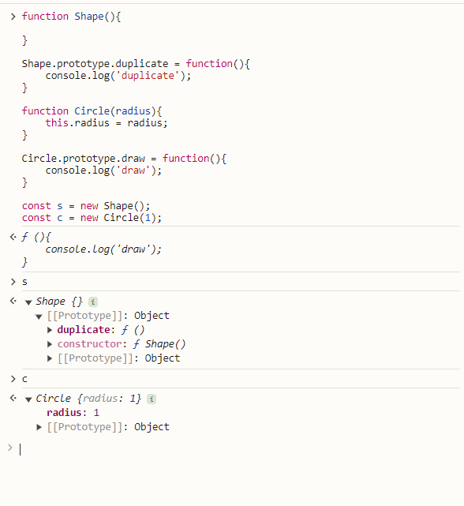
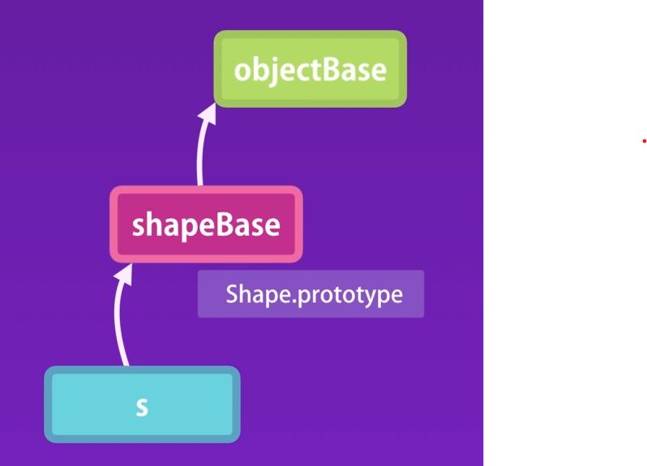

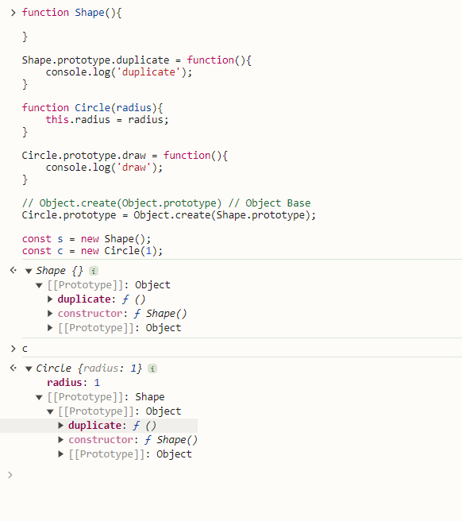


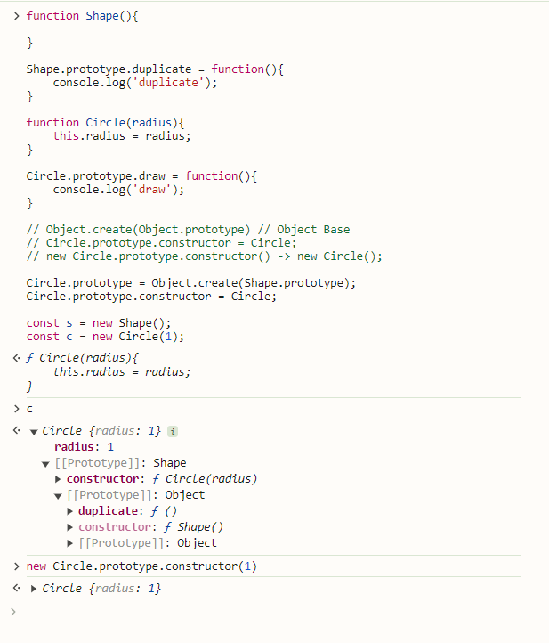


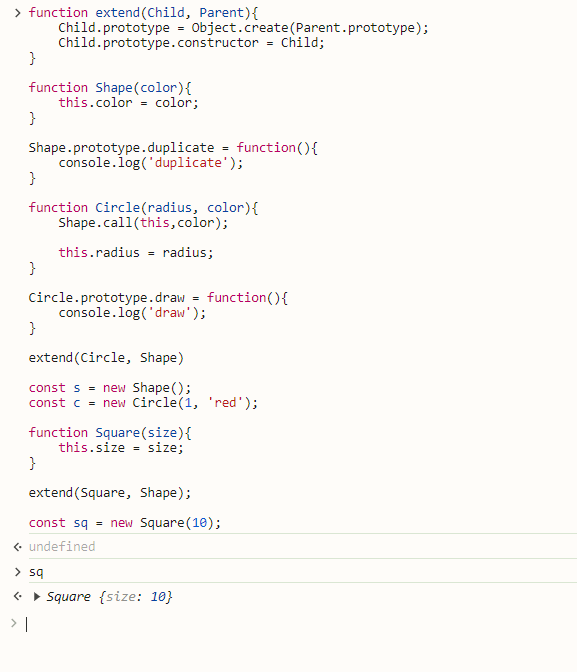
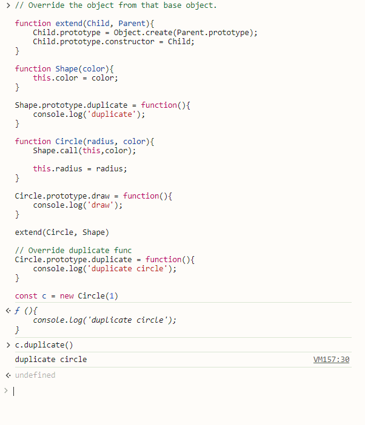
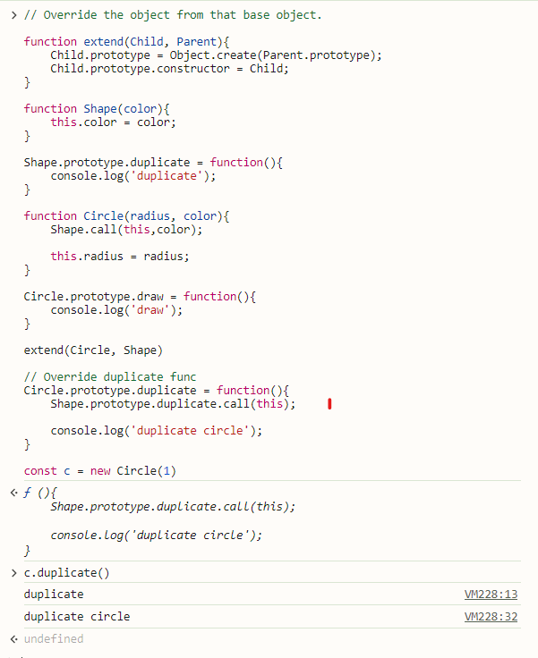

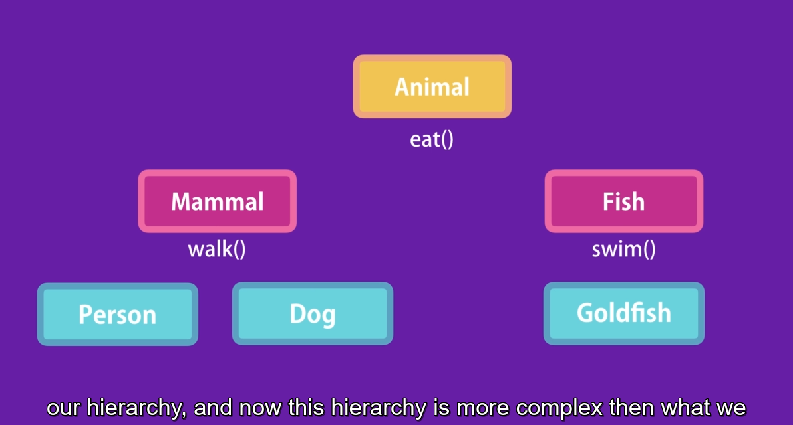
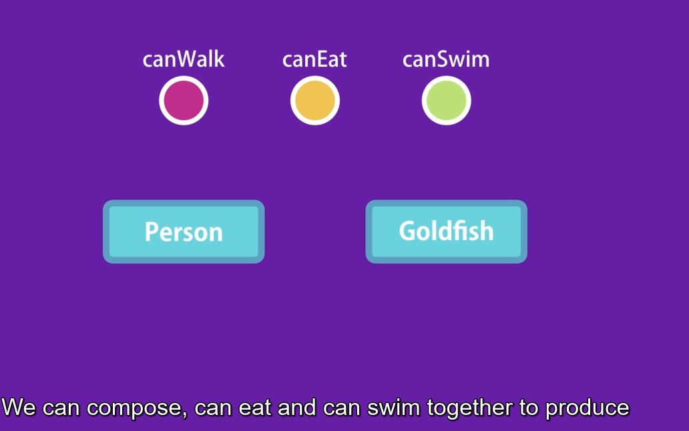

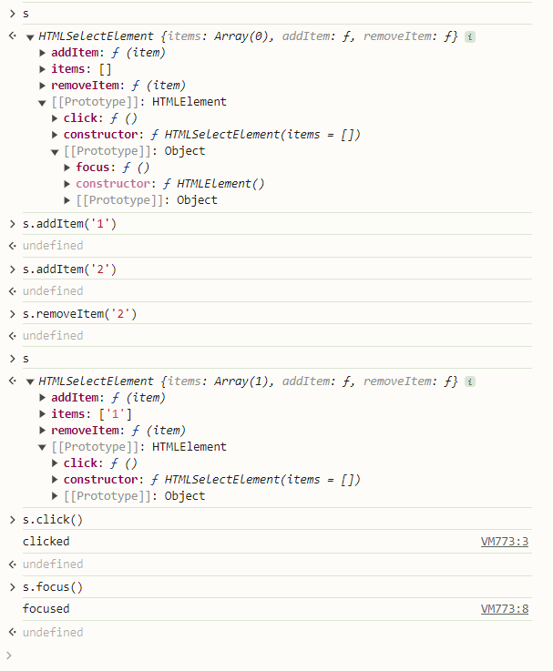


## Objects

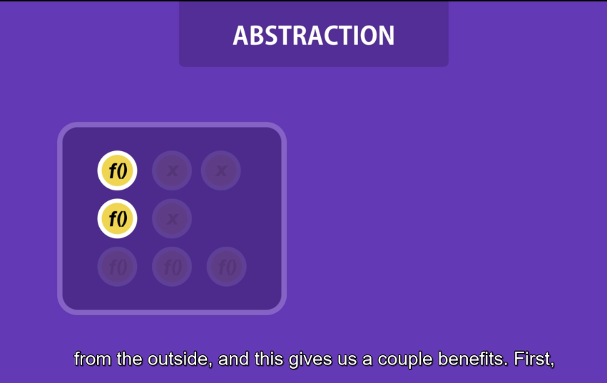

## Prototypes

Take properties and methods from another object.
Easy to reuse

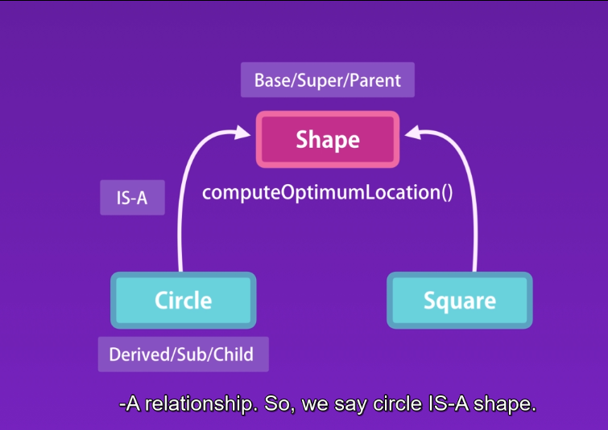

Classical vs Prototypical Inheritance

In JS, we don't have classes, we only have objects.
So, that's when prototypical inheritance comes in.

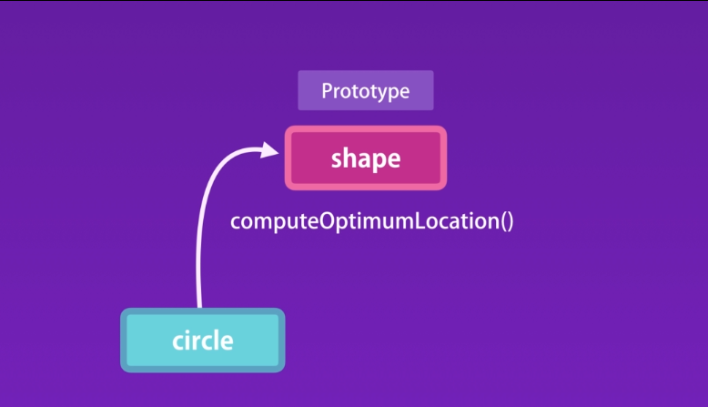


-   Same as define let y = {}

Every object has a constructor property which references the
function that was used to construct or create the object.

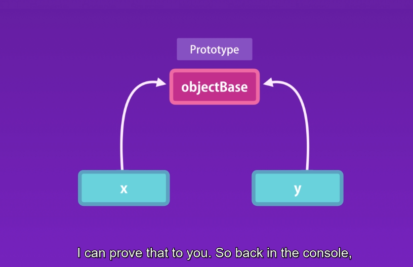


x.**proto** in debug mode. but deprecated.

How prototypical inheritance works ?
Initially JS engine lookout x object properties and methods object itself, if that couldn't find it will go to (parent)prototype for that object. And if it can find that member, it will look at the prototype of that object all the way up to the root object which we call here objectBase.

A prototype is just a regular object in memory. There is nothing special about it.
Every object has a prototype or parent, except the root object.

### Multilevel inheritance


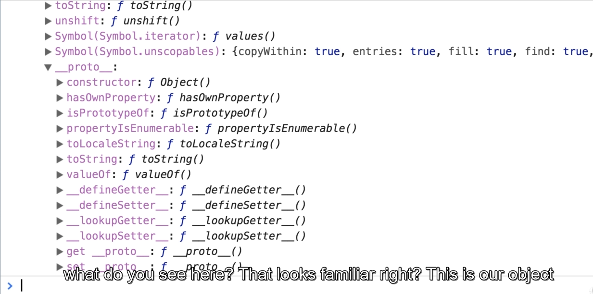


Object created by a given constructor will have the same prototype.

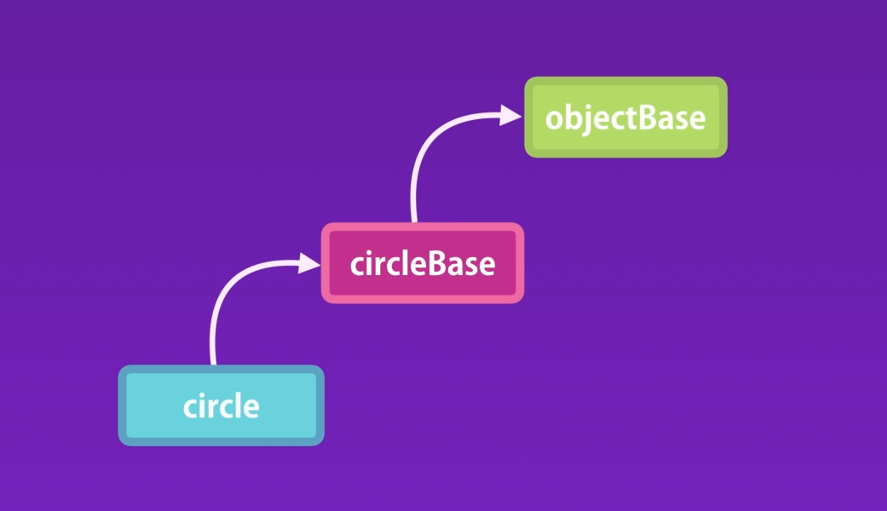

### Property Descriptor


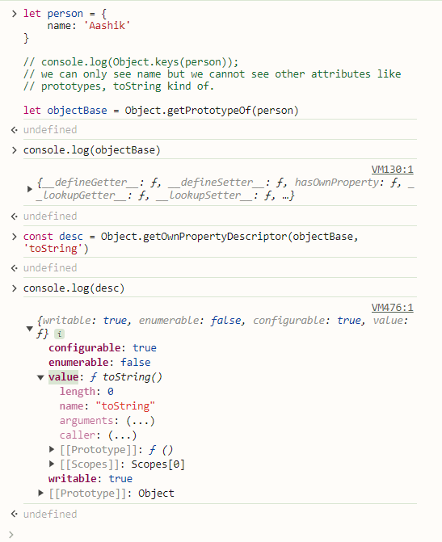

### Constructor Prototypes

Since we create that using object literal. Under the hood, we call Object constructor like new Object();


Same as like,
Array base
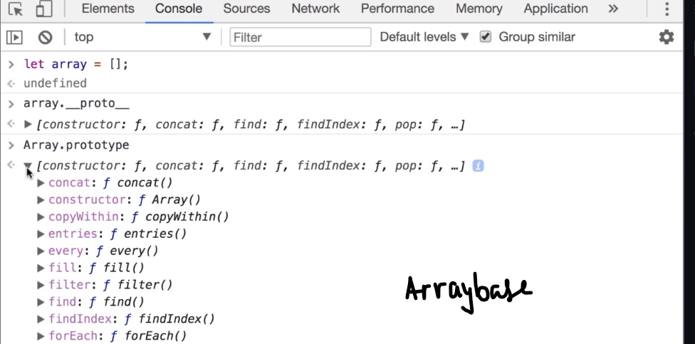

let array = []

array.**proto**

Array.prototype

Same as like,
Using Circle class constructor


### Prototype vs Instance Members


Prototype within instance.


Own property vs Prototype
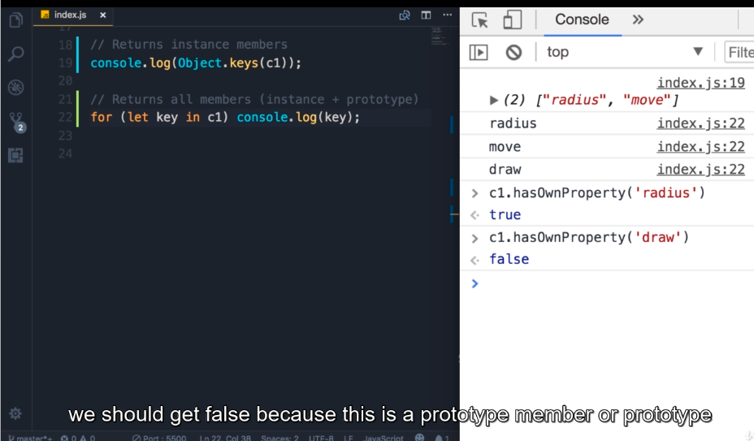

### Avoid Extending the Builtin Objects

Don't modify objects you don't own!.

## Classes

Function --> ES6 Classes


### Function Declaration

sayHello();

function sayHello(){}

-   Hoisted
    -- Can call before function.

### Function Expression

sayBye(); // error.

const sayBye = function(){};
const num = 1;

-   should terminate at the end for function expression.
-   Not hoisted

Only Function declaration is hoisted.


but for Class nothing is hoisted


### Private Members using Symbols

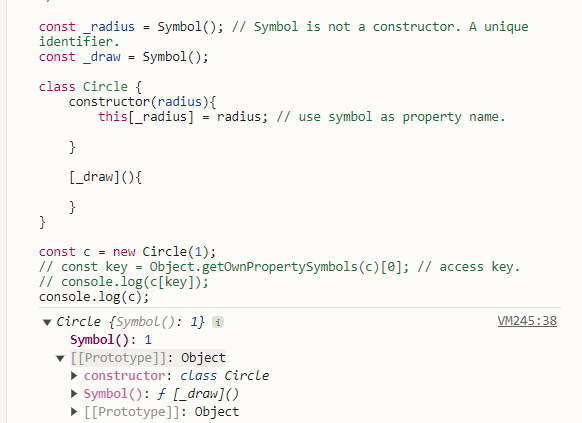

# Common Used JavaScript Functions

(Coding Questions Tailored) <br>

⭐ These functions and methods are frequently used in coding problems, interviews, and real-world logic building.

### 🔢 Number & Math Utilities

Number() – Converts a value to a number.

parseInt(), parseFloat() – Converts strings to integers or decimals.

isNaN() – Checks if a value is Not-a-Number.

Math.abs() – Returns absolute value.

Math.trunc() – Removes decimal part.

Math.sign() – Returns -1, 0, or 1 based on the number.

### 🔤 String Utility Functions (Very Common)

string.trim() – Removes whitespace from both ends.

string.startsWith(), string.endsWith() – Checks string boundaries.

string.charAt() – Gets character at index.

string.substring(), string.slice() – Extracts part of a string.

string.indexOf(), string.lastIndexOf() – Finds position of a substring.

### 📦 Array Functions (Most Important for Coding)

array.length – Size of array.

array.includes() – Checks if value exists.

array.indexOf() – Finds index of element.

array.sort() – Sorts array (⚠️ careful with numbers).

array.reverse() – Reverses array.

array.reduce() – Accumulates values (sum, count, group).

array.find(), array.findIndex() – Finds first matching element.

array.every(), array.some() – Checks conditions on all or some elements.

Array.from() – Converts iterable to array.

### 🔄 Loop Helpers (Used Instead of for-loops)

for...of – Loop through values.

for...in – Loop through object keys.

Object.keys() – Returns array of object keys.

Object.values() – Returns array of object values.

Object.entries() – Returns key-value pairs.

### 🧠 Object & Data Handling

Object.hasOwn() – Checks if key exists in object.

JSON.parse() – Converts JSON string → object.

JSON.stringify() – Converts object → JSON string.

structuredClone() – Deep clone objects (modern JS).

### ⚡ Logical & Comparison Helpers

typeof – Check data type.

Array.isArray() – Check if value is an array.

Boolean() – Converts value to true/false.

?? (Nullish Coalescing) – Handles null or undefined.

?. (Optional Chaining) – Safely access nested properties.

### 🕒 Timing & Async (Often Asked Conceptually)

setTimeout() – Executes code after delay.

setInterval() – Repeats execution.

clearTimeout(), clearInterval()

Promise.resolve(), Promise.reject()

async / await

### 🧪 Debugging & Testing Helpers

console.log() – Debug output.

console.table() – Visualize arrays/objects.

console.error() – Log errors.

### 📌 MOST USED IN CODING QUESTIONS (Quick List)

If you remember only these, you’re already ahead:

```js
map, filter, reduce
includes, indexOf
split, join, trim
sort, reverse
Object.keys, Object.values
Math.max, Math.min
```


## Important Concepts

JavaScript, at its core, is a single-threaded, synchronous language.

**Single-threaded**: It has one "thread" of execution. This means it can only do one thing at a very specific moment in time. Imagine a person who can only read one word at a time in a book, and cannot start the next word until they've finished the previous one.

**Synchronous**: Tasks are executed in sequence, one after the other. Line 2 of your code will not run until line 1 is completely finished.

If JavaScript were purely synchronous, when it hit a time-consuming task, the entire webpage would freeze. The user couldn't click, scroll, or do anything until that task was finished. This is a terrible user experience.

To solve this, JavaScript engines (like the one in your browser) have special APIs that allow us to perform these long-running operations asynchronously (in the background). But once that background task is done, how does JavaScript know? How does it get the result back into our main thread?

This is where Callbacks and Promises come in.


**Part 1: Callback Functions - The Original Solution**

**What is a Function in JS? A Tiny Detail**

In JavaScript, functions are "first-class citizens." This is a fancy way of saying you can treat them like any other variable. You can:

Store a function in a variable.

Pass a function as an argument to another function.

Return a function from another function.

This ability to pass a function as an argument is the key to callbacks.

**What is a Callback?**

A callback function is simply a function that is passed as an argument to another function, with the intention of being "called back" (executed) at a later time.

A Simple, Synchronous Example

Let's forget about time-consuming tasks for a moment and just understand the mechanics.

```javascript
// This is a "higher-order function" because it accepts another function as an argument.
function processUserInput(name, callback) {
    console.log("Received user input: " + name);
    // Now, we "call back" the function that was passed to us.
    callback(name);
}

// This is our callback function.
function greetUser(name) {
    console.log("Hello, " + name + "!");
}

// We call processUserInput and pass the greetUser function as the callback.
// Notice we are passing `greetUser`, not `greetUser()`. We are passing the function itself, not the result of calling it.
processUserInput("Alice", greetUser);
```

```terminaloutput
Received user input: Alice
Hello, Alice!
```

Here, `greetUser` is the callback. `processUserInput` received it and called it back when it was ready.

**Asynchronous Callbacks in Action**

Now let's apply this to an asynchronous operation. The most common example is setTimeout, which waits for a specified time before executing a function

```javascript
console.log("Ordering a pizza...");

// setTimeout is an asynchronous function provided by the browser.
// It takes two arguments:
// 1. A callback function (what to do after the timer finishes).
// 2. A delay in milliseconds.
setTimeout(function () {
    // This is our anonymous callback function.
    console.log("Pizza has arrived!");
}, 2000); // Wait for 2000 ms (2 seconds)

console.log("Doing my homework while waiting for the pizza...");
```

```terminaloutput
Ordering a pizza...
Doing my homework while waiting for the pizza...
// ... (2 seconds pass) ...
Pizza has arrived!
```

**What happened here?**

JavaScript runs `console.log("Ordering a pizza...").`

It sees `setTimeout`. It says to the browser's timer API, "Hey, can you please run this function for me after 2000ms? Thanks!"

Crucially, JavaScript **does not wait**. It immediately moves to the next line.

It runs `console.log("Doing my homework...")`.

The main script is now finished. But in the background, the browser's timer is still counting down.

After 2 seconds, the timer finishes and pushes the callback function back into the JavaScript queue to be executed.

`console.log("Pizza has arrived!")` is finally printed.

This is non-blocking! The program continued to run while waiting.


**The Big Problem: "Callback Hell"**

Callbacks work, but what if you need to perform multiple asynchronous operations in a sequence?

Imagine:

Fetch user data from a server.

**After** you get the user, fetch their list of blog posts.

**After** you get the posts, fetch the comments for the first post.

With callbacks, it would look like this:

```javascript
fetchUser(123, function (user) { // Callback 1
    console.log("Got user:", user.name);
    
    fetchPosts(user.id, function (posts) { // Callback 2, nested inside
        console.log("Got posts for user:", posts.length);
        
        fetchComments(posts[0].id, function (comments) { // Callback 3, nested deeper
            console.log("Got comments for first post:", comments.length);
            
            // What if we need to do another step?
            // The nesting continues...
            // This is called the "Pyramid of Doom" or "Callback Hell".
            
        }, function(error) { // Error handling for comments
             console.error("Error fetching comments:", error);
        });
        
    }, function(error) { // Error handling for posts
        console.error("Error fetching posts:", error);
    });
    
}, function(error) { // Error handling for user
    console.error("Error fetching user:", error);
});
```

This code is:

**Hard to read:** The deep nesting makes the logic flow confusing.

**Hard to maintain:** If you need to change something, you're navigating a complex pyramid.

**Error-prone:** Each level needs its own error handling, which gets repetitive and messy.

**Inversion of Control:** You are giving your callback function to another function, trusting that it will be called correctly (once, and only once). You've lost control over your code's execution.

This is the problem that Promises were created to solve.


#### Part 2: Promises - A Better Way

A **Promise** is an object that represents the eventual completion (or failure) of an asynchronous operation and its resulting value.

Think of it like ordering a pizza online. When you place the order, you get a receipt (a "promise"). You don't have the pizza yet, but you have a placeholder for it. This receipt tells you the current status:

**Pending**: Your order is being prepared. (The asynchronous operation is still in progress).

**Fulfilled (or Resolved):** Your pizza has been delivered! (The operation completed successfully, and you have the result - the pizza).

**Rejected**: The restaurant ran out of cheese. (The operation failed, and you have a reason for the failure).

A Promise can only be in one of these states. It starts as pending and eventually transitions to either fulfilled or rejected. Once settled (fulfilled or rejected), it can never change its state again.

**Creating a Promise**

While you'll most often consume promises from libraries or browser APIs (like fetch), it's useful to know how to create one.

```javascript
const myPizzaPromise = new Promise((resolve, reject) => {
    // This is the "executor" function. It runs immediately.
    // It contains the asynchronous logic.

    console.log("Preparing the pizza...");

    // Let's simulate a 2-second cooking time.
    setTimeout(() => {
        const isPizzaReady = true; // Let's pretend it was successful

        if (isPizzaReady) {
            // If successful, call the `resolve` function with the result.
            resolve("Here is your delicious Margherita pizza!");
        } else {
            // If it fails, call the `reject` function with the reason/error.
            reject("Sorry, we ran out of cheese.");
        }
    }, 2000);
});
```

The Promise constructor takes one argument: an "executor" function. This executor itself is given two functions as arguments: resolve and reject.

`resolve(value)`: You call this when your async operation is successful. The value is the result.

`reject(error)`: You call this when your async operation fails. The error is the reason.

**Consuming a Promise**

This is the beautiful part. We use the `.then()`, `.catch()`, and `.finally()` methods to handle the outcome.

```javascript
console.log("Placing my pizza order...");

myPizzaPromise
    .then( (successMessage) => {
        // This function runs ONLY if the promise is FULFILLED (resolved).
        // The `successMessage` is whatever was passed to the `resolve()` function.
        console.log("YAY! " + successMessage);
    })
    .catch( (errorMessage) => {
        // This function runs ONLY if the promise is REJECTED.
        // The `errorMessage` is whatever was passed to the `reject()` function.
        console.log("OH NO! " + errorMessage);
    })
    .finally( () => {
        // This function runs REGARDLESS of whether the promise was fulfilled or rejected.
        // Good for cleanup, like closing a loading spinner.
        console.log("The transaction is complete.");
    });

console.log("Doing my homework while waiting...");
```

```terminaloutput
Placing my pizza order...
Preparing the pizza...
Doing my homework while waiting...
// ... (2 seconds pass) ...
YAY! Here is your delicious Margherita pizza!
The transaction is complete.
```

**The Real Power: Chaining Promises**

This is how Promises solve "Callback Hell". The `.then()` and `.catch()` methods **themselves return a new Promise**. This allows us to chain them together in a flat, readable sequence.

Let's rewrite our "Callback Hell" example using Promises. Assume `fetchUser`, `fetchPosts`, and `fetchComments` now return Promises.

```javascript
fetchUser(123)
    .then(user => {
        console.log("Got user:", user.name);
        // Important: We RETURN the next promise in the chain.
        return fetchPosts(user.id);
    })
    .then(posts => {
        console.log("Got posts for user:", posts.length);
        // Return the next promise...
        return fetchComments(posts[0].id);
    })
    .then(comments => {
        console.log("Got comments for first post:", comments.length);
    })
    .catch(error => {
        // A SINGLE .catch() can handle errors from ANY of the preceding promises in the chain!
        console.error("An error occurred in the chain:", error);
    });
```

Look at the difference!

**Readable**: It reads like a sequence of steps. "Then do this, then do this..."

**Flat**: No more pyramid of doom.

**Centralized Error Handling**: A single .catch() at the end gracefully handles a failure at any point in the chain. If fetchUser fails, the chain immediately jumps to the .catch() block, skipping all the .then() blocks.

### Summary: Callbacks vs. Promises

| Feature          | Callback Style                                                 | Promise Style                                                                      |
|:-----------------|:---------------------------------------------------------------|:-----------------------------------------------------------------------------------|
| **Readability** | Poor. Leads to "Callback Hell" with nested operations.         | Excellent. Linear, flat, and easy to follow with `.then()` chaining.               |
| **Error Handling** | Messy. Each callback needs its own error-handling logic.       | Clean. A single `.catch()` at the end can handle all errors in a chain.            |
| **Control Flow** | "Inversion of Control". You give away control of your function. | You receive a Promise object back immediately. You control when and how to handle it. |
| **State** | No formal state. It's just a function waiting to be called.    | Has a well-defined state: `pending`, `fulfilled`, or `rejected`.                   |
| **Return Value** | The higher-order function might not return anything useful.    | Always returns a Promise object, which can be passed around and chained.           |

## A Glimpse into the Future: async/await

Modern JavaScript has an even cleaner syntax built on top of Promises called async/await. It makes asynchronous code look almost exactly like synchronous code.

Here is the same promise chain written with async/await:

```js
async function showUserContent() {
    try {
        const user = await fetchUser(123);
        console.log("Got user:", user.name);

        const posts = await fetchPosts(user.id);
        console.log("Got posts for user:", posts.length);

        const comments = await fetchComments(posts[0].id);
        console.log("Got comments for first post:", comments.length);

    } catch (error) {
        // The try...catch block replaces the .catch() for error handling.
        console.error("An error occurred:", error);
    }
}

showUserContent();
```

Even though it looks different, under the hood, this is still 100% using Promises. await simply "pauses" the function execution until the Promise resolves, and try...catch is how we handle rejections. It's the ultimate solution for readability that Promises made possible.

Of course. Here is the detailed explanation on why we still use Promises with `async/await`, formatted in Markdown.

-----

# Why We Still Use Promises with async/await

The shortest answer is: **`async/await` is not a replacement for Promises; it is syntactic sugar built *on top of* Promises.**

You cannot have `async/await` without Promises. They are fundamentally linked. `async/await` is a powerful new way to *work with* and *write* code that uses Promises, but it doesn't eliminate the need for them.

Think of it like this: Promises are the engine and the wheels of a car. `async/await` is the beautiful dashboard, the comfortable seats, and the power steering. It makes driving the car much more pleasant, but it's still the same car underneath.

Here are the specific reasons why we still use Promises directly, even in a world with `async/await`.

---

### 1. The Foundation: `async/await` *is* Promises

This is the most critical point to understand.
* An `async` function **always** returns a Promise.
* The `await` keyword **only works on Promises** (or "thenables," objects that behave like Promises). When you `await` something, you are telling JavaScript to pause the function's execution until that Promise settles.

Let's look under the hood:

**This `async/await` code:**
```javascript
async function getUserData() {
    console.log("Fetching user...");
    const response = await fetch('[https://api.example.com/user/1](https://api.example.com/user/1)');
    const data = await response.json();
    console.log("Got data:", data);
    return data;
}

getUserData().then(data => console.log("Final data from the returned promise:", data));
````

**Is just a much cleaner way to write this Promise-based `.then()` chain:**

```javascript
function getUserData() {
    console.log("Fetching user...");
    return fetch('[https://api.example.com/user/1](https://api.example.com/user/1)')
        .then(response => {
            return response.json();
        })
        .then(data => {
            console.log("Got data:", data);
            return data;
        });
}

getUserData().then(data => console.log("Final data from the returned promise:", data));
```

Notice that in both cases, you have to call `getUserData().then(...)` to get the final result, because the function itself returns a promise.

-----

### 2\. Handling Concurrent Operations: `Promise.all()` & Friends

`async/await` is fantastic for running asynchronous tasks in **sequence**. But what if you want to run multiple tasks in **parallel** and wait for all of them to finish? This is where you *must* use the `Promise` object's static methods.

**The wrong way (sequential):** This takes 3 seconds because each `await` waits for the previous one to complete.

```javascript
async function getParallelDataSlowly() {
    console.time("slow");
    const user = await fetchUser(1);    // Takes 1 second
    const posts = await fetchPosts(1);   // Takes 1 second
    const comments = await fetchComments(1); // Takes 1 second
    console.timeEnd("slow"); // logs "slow: ~3000ms"
    return { user, posts, comments };
}
```

**The right way (concurrent with `Promise.all()`):** This only takes 1 second because all three network requests are fired off at the same time. `await` then waits for the single Promise returned by `Promise.all()` to resolve.

```javascript
async function getParallelDataFast() {
    console.time("fast");
    // 1. Start all operations at once and store their promises in an array.
    const userPromise = fetchUser(1);
    const postsPromise = fetchPosts(1);
    const commentsPromise = fetchComments(1);

    // 2. Use Promise.all() to create a single promise that resolves
    //    when all promises in the array have resolved.
    const [user, posts, comments] = await Promise.all([
        userPromise,
        postsPromise,
        commentsPromise
    ]);

    console.timeEnd("fast"); // logs "fast: ~1000ms"
    return { user, posts, comments };
}
```

You simply cannot achieve this kind of concurrency with `await` alone. You need methods like:

* `Promise.all(promises)`: Fulfills when *all* promises fulfill, rejects if *any* promise rejects.
* `Promise.allSettled(promises)`: Fulfills when *all* promises have settled (either fulfilled or rejected).
* `Promise.race(promises)`: Settles as soon as the *first* promise in the array settles.
* `Promise.any(promises)`: Fulfills as soon as the *first* promise fulfills.

-----

### 3\. Creating Promises: The `new Promise` Constructor

`async/await` is for *consuming* promises. But what if you need to *create* a promise? This is common when you're working with older, callback-based APIs (like `setTimeout`). You must use the `new Promise()` constructor to "promisify" them.

```javascript
// A function that uses a callback
function legacyDownload(url, successCallback, failureCallback) {
    setTimeout(() => {
        if (url) {
            successCallback("Data from " + url);
        } else {
            failureCallback("URL was not provided");
        }
    }, 1000);
}

// "Promisifying" the old function. async/await can't help here.
function modernDownload(url) {
    return new Promise((resolve, reject) => {
        legacyDownload(url,
            (data) => resolve(data),      // on success, resolve the promise
            (error) => reject(error)      // on failure, reject the promise
        );
    });
}

// Now we can consume it with async/await!
async function startDownload() {
    try {
        const data = await modernDownload("my-file.txt");
        console.log(data); // "Data from my-file.txt"
    } catch (error) {
        console.error(error);
    }
}
```

-----

### 4\. When You Don't Need to `await`

Sometimes you want to fire off an asynchronous task but not wait for it to complete inside the current function. In this case, you work with the promise object itself, returning it so that the *calling function* can decide when or if to `await` it.

```javascript
function beginLongProcess() {
    console.log("Starting a long process in the background...");
    // Return the promise, don't await it here
    return new Promise(resolve => setTimeout(() => {
        console.log("Background process finished!");
        resolve(42);
    }, 2000));
}

async function main() {
    const processPromise = beginLongProcess();
    console.log("Main function continues its work...");
    // ... do other synchronous stuff ...
    console.log("Now I need the result from the background process.");
    const result = await processPromise; // We finally await the promise here
    console.log("The result is:", result);
}
```

-----

### Summary: The Golden Rule

> Use both, because they are designed to work together.

* **Use `async/await`** for your main control flow. It makes sequential asynchronous steps incredibly clean and readable. It's the default, modern way to write asynchronous logic.
* **Drop down to direct `Promise` methods** when you need more power or specific functionality that `async/await` doesn't provide, such as:
    * Running tasks in parallel (`Promise.all`).
    * Wrapping old callback APIs (`new Promise`).
    * Handling complex race conditions (`Promise.race`, `Promise.any`).

