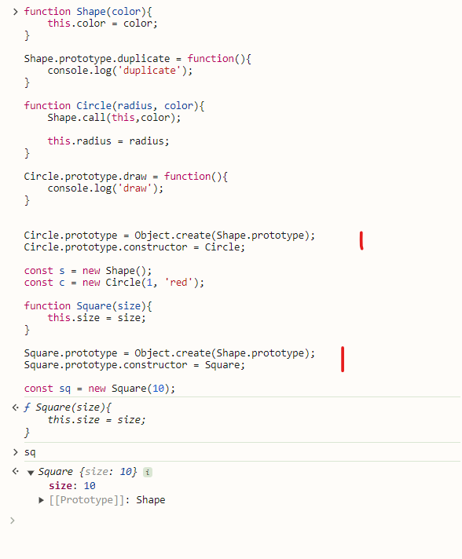

# Basics for Beginners

## Basics

**Data Types**


**2 types of programming languages.**

1. Static
   string name = 'Jhon'
   This type of variable cannot be changed after set

2. Dynamic
   let name = 'Jhon'
   Can change at runtime

**Reference types**

1. Object
2. Array
3. Function

## Operators

We use Operators with variables and constants to create
expressions.
and with these expression we can create logic and algorithms.

--- Operators ---

1. Arithmetic
2. Assignment
3. Comparison
4. Logical
5. Bitwise


**Logical with Non Boolean**


## If else

// Conditional Statements
// If-else
// Switch-case

```javascript
if (conditon) {
    statment;
} else if (anotherConditon) {
    statment1;
    statement2;
} else if (yetAnotherConditon) statment;
else statement;
```

If one statement no need to put curly braces.

## Objects

### Value vs Reference Types

VALUE / PRIMITIVE

1. Number
2. String
3. Boolean
4. Symbol
5. undefined
6. null

Reference
Object
Function
Array

in JS, we have Primitives and Objects. Almost Reference Types fulla objects
How Primitives and Objects behave differently.
SHOULD UNDERSTAND - for Prototypes

Primitives are copied by their value.
Ref types or Objects are copied by their reference.


------Cloning Object-------------

Object.assign() copies the properties and methods from 1 or
more source objects into target object.
we can use that to clone an object or combine multiple objects
into single object.

Spread Operator used to spread an object, means getting all
it's properties and methods and putting them into another object.

--Garbage Collecter--------
In JS, we don't need to allocate or deallocate their memory
when declaring variables.
it will do automatically by own.

-----Math---------
Math Object used to do arithmetic things.
Math.random()
Math.min()
Math.max()

---

Object is only have properties and methods.
Not Primitives.

# Object Oriented Programming





## Objects


## Prototypes

Take properties and methods from another object.
Easy to reuse


Classical vs Prototypical Inheritance

In JS, we don't have classes, we only have objects.
So, that's when prototypical inheritance comes in.


-   Same as define let y = {}

Every object has a constructor property which references the
function that was used to construct or create the object.


x.**proto** in debug mode. but deprecated.

How prototypical inheritance works ?
Initially JS engine lookout x object properties and methods object itself, if that couldn't find it will go to (parent)prototype for that object. And if it can find that member, it will look at the prototype of that object all the way up to the root object which we call here objectBase.

A prototype is just a regular object in memory. There is nothing special about it.
Every object has a prototype or parent, except the root object.

### Multilevel inheritance


Object created by a given constructor will have the same prototype.


### Property Descriptor


### Constructor Prototypes

Since we create that using object literal. Under the hood, we call Object constructor like new Object();


Same as like,
Array base


let array = []

array.**proto**

Array.prototype

Same as like,
Using Circle class constructor


### Prototype vs Instance Members


Prototype within instance.


Own property vs Prototype


### Avoid Extending the Builtin Objects

Don't modify objects you don't own!.

## Classes

Function --> ES6 Classes


### Function Declaration

sayHello();

function sayHello(){}

-   Hoisted
    -- Can call before function.

### Function Expression

sayBye(); // error.

const sayBye = function(){};
const num = 1;

-   should terminate at the end for function expression.
-   Not hoisted

Only Function declaration is hoisted.


but for Class nothing is hoisted


### Private Members using Symbols


